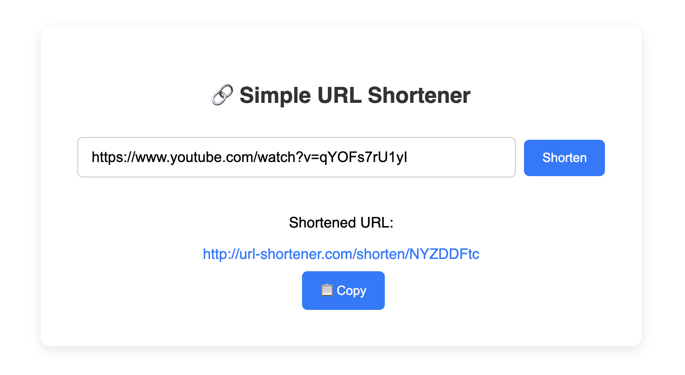

# 🔗 URL Shortener

A simple and lightweight URL shortener built with **Node.js** and **Express**. Generate short links that redirect to original long URLs — great for sharing, tracking, and simplifying URLs.



---

## 🚀 Features

- Create short links from long URLs
- Redirect short links to the original URLs
- Client-side UI to shorten URLs and copy results
- In-memory storage using `Map` for quick development
- Clipboard copy support
- Metrics-ready structure for tracking visits (timestamp, IP, user agent) [Future Scope]

---

## 📦 Tech Stack

- Node.js
- Express.js
- HTML/CSS/JavaScript (frontend)
- `dotenv` for environment configs

---

## 🔧 Installation

Clone the repository and install dependencies:

```bash
git clone https://github.com/blueberries4/url-shortener.git
cd url-shortener
npm install
```

Made with ❤️ by @blueberries4